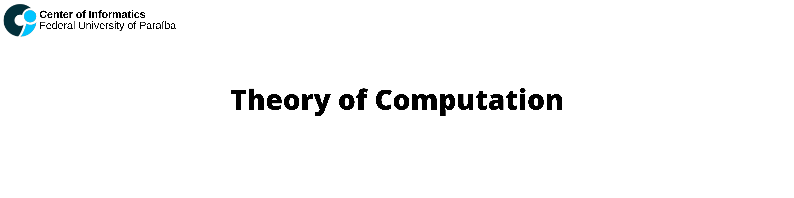

  

This repository contains the main algorithms developed in the course Theory of Computation at [UFPB](https://www.ufpb.br), oriented by [Professor Bruno Petrato Bruck](http://lattes.cnpq.br/8375218408755980). 

## Table of Contents
- [References:](#references)

## References:
- Sipser, M. (2012). Introduction to the Theory of Computation. United States: Cengage Learning.
- SIPSER, Michael; QUEIROZ, Ruy José Guerra Barretto; VIEIRA, Newton José. Introdução à teoria da computação. São Paulo: Cengage Learning, 2015, 2016, 2017. 459p. ISBN: 9788522104994. (MAIN REFERENCE)
